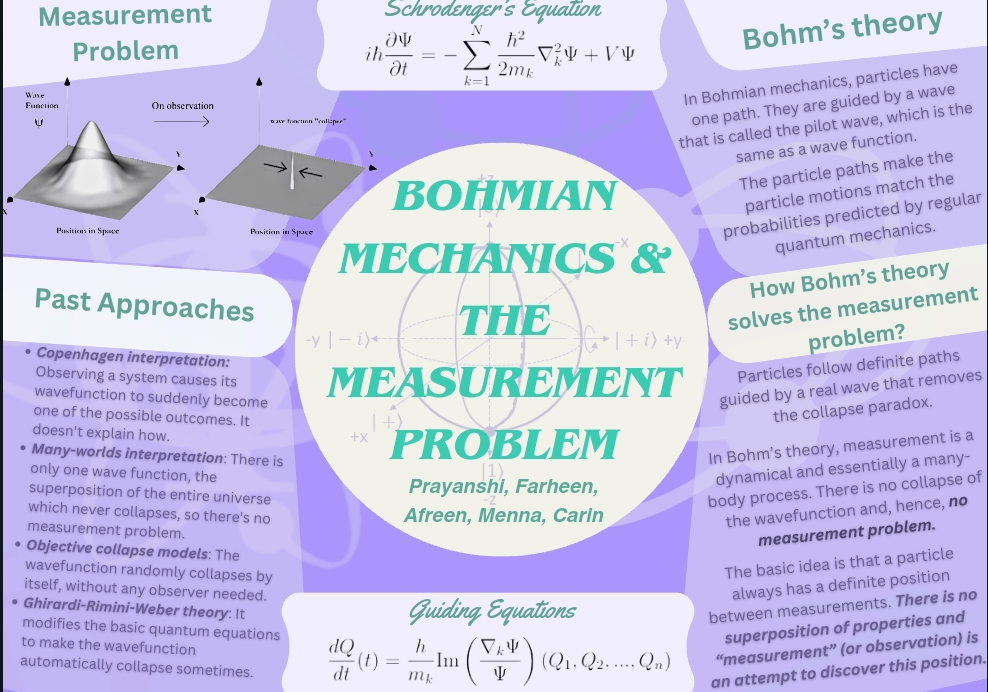

# Bohmian Mechanics and the Measurement Problem  

## 📖 About This Project  
This research paper was developed as part of the **"Introduction to Quantum Research for Girls"** program—a **9-week initiative** offered by [PhysicsBeyond](https://physicsbeyond.com/) and [Girls in Quantum](https://www.girlsinquantum.com/).  

The project was conducted during the course phase with the guidance of the **Mayer team**, consisting of:  
- **Farheen**  
- **Carin Samer**  
- **Prayanshi Garg**  
- **Menna Mohammed**  
- **Afreen Hossam**  

## 🧑‍🔬 Research Focus  
Our research explores **Bohmian Mechanics**, a deterministic interpretation of quantum mechanics, and its potential to resolve the **measurement problem**.  

## 📌 Acknowledgments  
We extend our gratitude to **PhysicsBeyond** and **Girls in Quantum** for organizing this insightful program and providing us with the opportunity to delve into quantum research.  

## 📄 Read the Paper  
[Click here to access the full research paper](./Bohmian_Mechanics_Mayer_group_2.pdf)  

---

### 🌟 Connect With Us!  
💡 Interested in quantum mechanics? Feel free to connect and share your thoughts!  

🔗 **Follow PhysicsBeyond:** [Website](https://physicsbeyond.com/) | [Twitter](https://twitter.com/PhysicsBeyond)  
🔗 **Follow Girls in Quantum:** [Website](https://www.girlsinquantum.com/) | [Twitter](https://twitter.com/girlsinquantum)  
